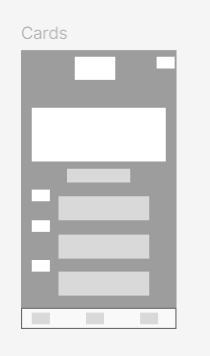
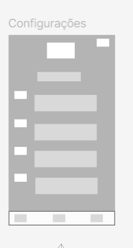
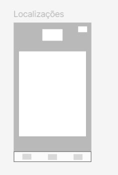
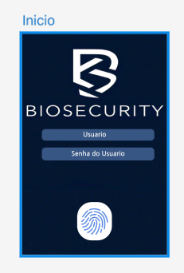
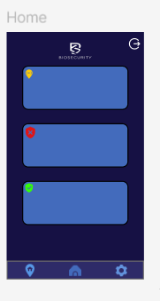
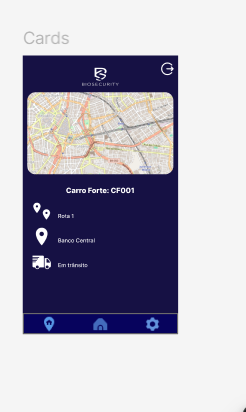
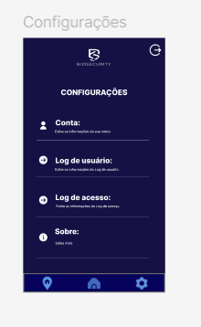
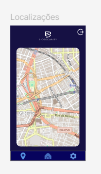

# Documentação do Projeto: Controle de Acesso por Biometria e Localização

## Escopo do Projeto
O projeto visa desenvolver uma aplicação mobile que permita o controle de acesso de usuários através da autenticação biométrica e da verificação de localização geográfica. A aplicação só permitirá o acesso se o usuário estiver dentro da área permitida, combinando a autenticação por impressão digital com a confirmação da localização. O backend será gerenciado pelo Firebase, e o Flutter será utilizado para o desenvolvimento da interface. A aplicação será testada e implementada em dispositivos Android utilizando o Android Studio.

## Objetivos SMART

- **Específico:** Criar uma aplicação de controle de acesso que utilize autenticação biométrica e verificação de localização para garantir segurança, com gerenciamento de usuários e dados no Firebase.
  
- **Mensurável:** O sucesso será medido pela implementação das funcionalidades principais, como autenticação biométrica, verificação de localização e integração com Firebase para armazenamento e controle de dados.
  
- **Atingível:** A aplicação será desenvolvida em 1 semana, utilizando Flutter, Firebase, Geolocator e autenticação local para biometria.
  
- **Relevante:** Aumentar a segurança no controle de acesso de áreas restritas, garantindo que apenas usuários autorizados e em locais permitidos tenham acesso.
  
- **Temporal:** Lançar a versão inicial da aplicação em 7 dias.

## Cronograma

| Fase                            | Duração    | Início      | Término     |
|----------------------------------|------------|-------------|-------------|
| Configuração do Ambiente         | 1 dia      | 21/10/2024  | 21/10/2024  |
| Implementação da Autenticação    | 2 dias     | 22/10/2024  | 23/10/2024  |
| Implementação da Geolocalização  | 2 dias     | 23/10/2024  | 24/10/2024  |
| Integração com Firebase          | 1 dia      | 25/10/2024  | 26/10/2024  |
| Testes e Ajustes Finais          | 1 dia      | 27/10/2024  | 28/10/2024  |

## Análise de Risco

- **Riscos Técnicos:** Problemas de integração entre a biometria e a geolocalização ou falhas de segurança.  
  **Mitigação:** Utilizar bibliotecas confiáveis como Local Auth e Geolocator, além de seguir as melhores práticas de segurança no Firebase.

- **Riscos de Prazo:** Possíveis atrasos na implementação da autenticação biométrica em dispositivos específicos.  
  **Mitigação:** Testar desde o início em múltiplos dispositivos para garantir compatibilidade e desempenho.

- **Riscos Financeiros:** Custos com a utilização de Firebase para autenticação e banco de dados.  
  **Mitigação:** Usar o plano gratuito do Firebase durante o desenvolvimento e planejar uma migração para o plano pago conforme o aumento de usuários.

## Recursos

- **Pessoas:** 4 desenvolvedores.
- **Tecnologia:** Flutter, Firebase, Geolocator, Local Auth, Android Studio.

## Prototipagem

### Baixa Fidelidade
- #### Tela 1

- #### Tela 2

- #### Tela 2.1

- #### Tela 2.2

- #### Tela 2.3

## Alta Fidelidade
- #### Tela 1

- #### Tela 2

- #### Tela 2.1

- #### Tela 2.2

- #### Tela 2.3
